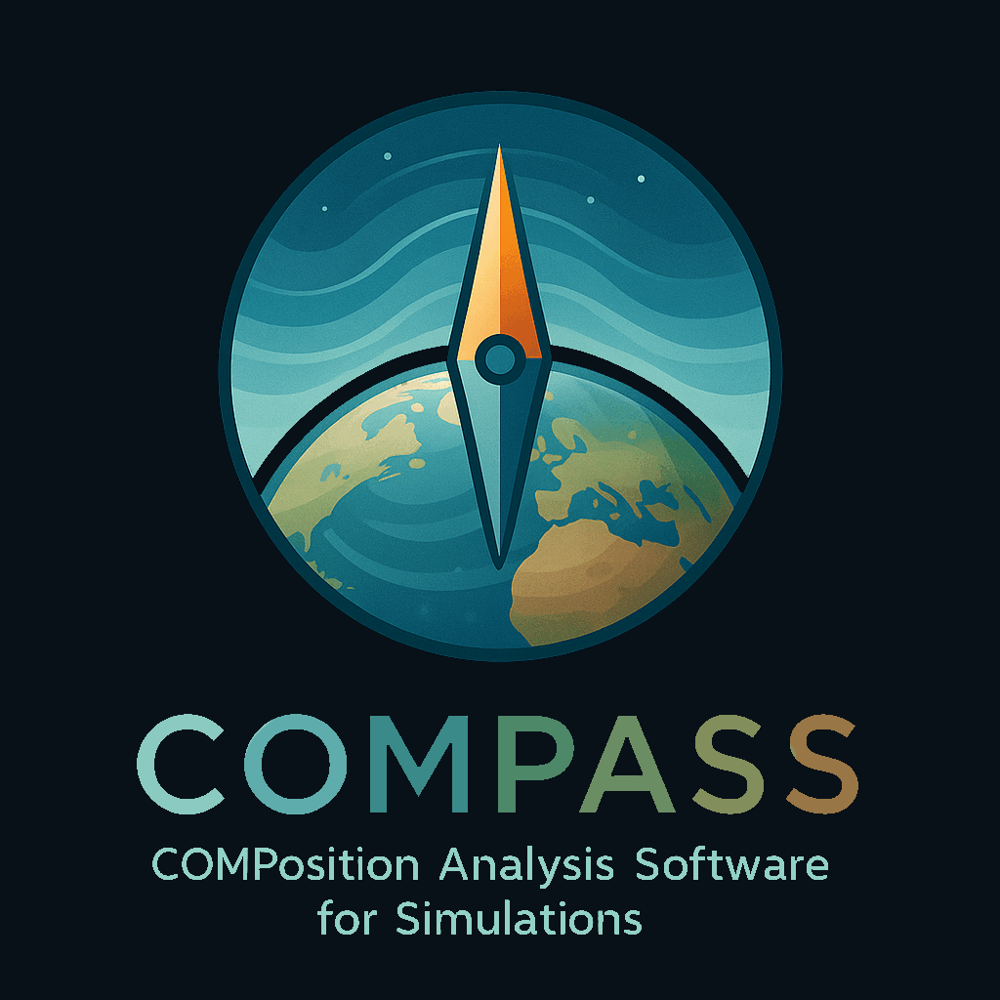

  

This software was developed by Athanasios Tsikerdekis (KNMI) to compare experiments of IFS-COMPO.

## 📜 Attribution

...

## 📥 Download Test Data

...

## 🛠 Environment

1. Install Miniforge3:  
   🔗 https://github.com/conda-forge/miniforge

2. Create the environment using mamba:  
   `mamba env create -f environment/COMPASS.yml`

3. Activate the environment:  
   `mamba activate COMPASS`

## ⚙️ Installation

Modify the following paths before running the code:  
- `00.start.R` → See variables under section `INPUT` and variable `path_code`
- `01.init.R`  → See all `path_*` variables 

## ▶️ Running PEF

Run the script:  
`Rscript 00.start.R` 

